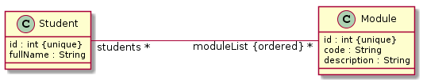
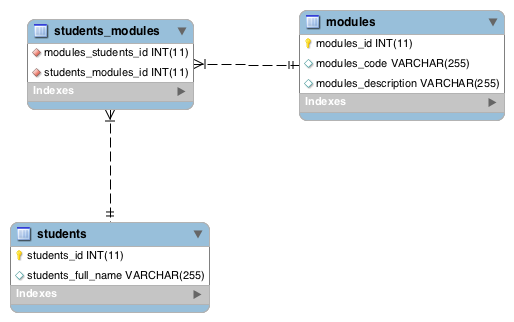

<link rel='stylesheet' href='web/swiss.css'/>

# Spring Data Exercises

This is a SpringBoot application that only consists of a persistence layer formed by **domain classes** and by **repository interfaces**.

## Configure the database connection

Using your credentials as explained in the lecture :movie_camera: [L9. Spring Data](https://leicester.cloud.panopto.eu/Panopto/Pages/Viewer.aspx?id=dbcfac72-69ea-4ec1-a384-42455e5c128c).

## :star: Exercise 01

In interface `springData.repository.ModuleRepository`, add a method to find modules by their attribute `description`.

## :star::star: Exercise 02

Given the following domain classes, already implemented in package `springData.domain`: 

The exercise consists in annotating the Java classes in the package `springData.domain` in order to generate the following schema in the database:

whose SQL DDL script is as follows:

	CREATE TABLE IF NOT EXISTS `ab373`.`modules` (
	  `modules_id` INT(11) NOT NULL,
	  `modules_code` VARCHAR(255) NULL DEFAULT NULL,
	  `modules_description` VARCHAR(255) NULL DEFAULT NULL,
	  PRIMARY KEY (`modules_id`))
	
	CREATE TABLE IF NOT EXISTS `ab373`.`students` (
	  `students_id` INT(11) NOT NULL,
	  `students_full_name` VARCHAR(255) NULL DEFAULT NULL,
	  PRIMARY KEY (`students_id`))
	
	CREATE TABLE IF NOT EXISTS `ab373`.`students_modules` (
	  `modules_students_id` INT(11) NOT NULL,
	  `students_modules_id` INT(11) NOT NULL,
	  INDEX `FK3ah1sd78bn4ebo9iv580nhelq` (`students_modules_id` ASC),
	  INDEX `FKfgffxpiei0e99weuuefvhfcqo` (`modules_students_id` ASC),
	  CONSTRAINT `FKfgffxpiei0e99weuuefvhfcqo`
	    FOREIGN KEY (`modules_students_id`)
	    REFERENCES `ab373`.`students` (`students_id`),
	  CONSTRAINT `FK3ah1sd78bn4ebo9iv580nhelq`
	    FOREIGN KEY (`students_modules_id`)
	    REFERENCES `ab373`.`modules` (`modules_id`))
	    
Take into account the following:	    
* Names of tables, columns and foreign keys must match those that appear in the schema.
* All database operations performed on a student must be cascaded to linked modules. 

## :star::star: Exercise 03

The main class `springData.SpringDataExerciseApp` has been configured to run some initialisation code in the method `run` when the spring boot app is started. Add code in that method in order to solve the following exercises.

### Exercise 3.a

* Create an unmanaged module with code `CO2006` and with name `Software Engineering and System Development` to the repository. 
* Check that it is inserted by running the query `select * from modules` in your database from MySQLWorkbench.

### Exercise 3.b

* Create an unmanaged student with your name to your database and link it to the module `CO2006` through the `moduleList` attribute.
* Create a new unmanaged module `CO2012` with name `Software project management and professionalism` and link it to the student through the student's `moduleList` attribute.
* Save the student to the table `students` using `StudentRepository`.
* Check that the module `CO2012` has been saved as well using the method `findByCode` from the `ModuleRepository`.

	    
