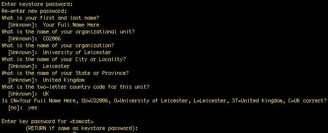
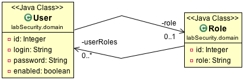

<link rel='stylesheet' href='web/swiss.css'/>

# SpringMvc_product_sec

Base code implementing a security layer with users of role `MANAGER`, who have access to the product catalogue only in our online shop `EMarket`.

## Goal

In this tutorial, we are going to discuss how to augment our web applications with the security control measures discussed in the lecture regarding:
* Secure communication using a public key infrastructure.
* Access control using [Spring Security](http://projects.spring.io/spring-security/):
  * consideration of one type of users in the domain model;
  * authentication using secure passwords with the algorithm BCrypt; and
  * authorization.

## Tutorial

### Setting the infrastructure

You need to set up the infrastructure that was used for the lab session on view technology and on JPA. 

Make sure you have the right dependencies in your script [build.gradle](https://github.com/uol-inf/CO2006-16-17/tree/master/sprint3/SpringMvc_product_sec/build.gradle).
	

### Secure communication using a public key infrastructure

In this section, we are going to implement a partial public key infrastructure in which the only step that we are going to skip is the deployment of the digital certificate on to a CA server. The first step is to create the digital certificate and the second step is to configure the web application with it. 

#### Generating the digital certificate

We are going to use [Java's keytool](https://docs.oracle.com/javase/6/docs/technotes/tools/windows/keytool.html), a key and certificate management utility. It allows users to administer their own public/private key pairs and associated certificates for use in self-authentication in a public key infrastructure. It also allows users to cache the public keys (in the form of certificates) of their communicating peers. keytool stores the keys and certificates in a [keystore](https://docs.oracle.com/javase/6/docs/technotes/tools/windows/keytool.html#KeyStore).

The first step is to generate a digital certificate (X.509 v3 self-signed) that contains a key pair (a public key and associated private key) by using the option `-genkeypair`. Run the following command from a terminal console: 

	keytool -genkeypair -alias tomcat -keyalg RSA -keystore ./keystore.jks

In the command above:
* The certificate and the private key are stored in a new keystore entry identified by `-alias`. 
* `-keyalg` specifies the algorithm to be used to generate the key pair,
* `-keystore` indicates the keystore location. If the JKS storetype is used and a keystore file does not yet exist, then certain keytool commands may result in a new keystore file being created.
* Other parameters, such as a validity period for the certificate, can also be specified. Check [keytool's documentation](https://docs.oracle.com/javase/6/docs/technotes/tools/windows/keytool.html) for more details.

The command will prompt an interactive dialogue in which you have to provide the information requested:
* Use `123456` as password for both the keystore and for the certificate:

Copy the generated file `keystore.jks` to folder `src/main/resources`. 

#### Setting up SSL/TLS for the web application

Configure the web container to use the port 8090 with SSL by adding the following lines to file `application.properties`:

	server.port=8090
	server.ssl.key-store=classpath:keystore.jks
	server.ssl.key-store-password=123456
	server.ssl.key-password=123456

Ask the servlet container to secure all http requests by appending the following lines to the configuration of the `http` object in method `configure()` of the class [eMarket.SecurityConfig](https://github.com/uol-inf/CO2006-16-17/tree/master/sprint3/SpringMvc_product_sec/src/main/java/eMarket/SecurityConfig.java) by using `http.requiresChannel().anyRequest().requiresSecure();`.

The `HttpSecurity` class is discussed in more detail below.

By running `gradle bootRun`, you should be able to access to your application at `https://localhost:8090/` in a secure way. That is, all the information that you enter in a form is going to be encrypted. However, as discussed in the lecture the browser should still complain that the digital certificate has not been registered by a Certification Authority (CA).

### Access Control

In this section, we are going to implement the three aspects of access control introduced in the lecture.

#### User identification

The concepts of user and of role are going to be included in the domain model so that our system gains knowledge about real users. We are going to hook these classes into the Spring Security framework so that we can reuse the authentication mechanism that is built in the framework. The information about users will be kept in a MySQL database through JPA and Hibernate as we did in previous sessions.

In previous worksheets, we have considered the business logic of the web app in the controller class and in the domain model, which may suffice for simple web apps. A **service layer** allows us to decouple the business logic from the web layer (controllers, views, validation, error handling, ...) from the repository layer (persistence in a database), allowing us to develop more interesting functionality involving transactions and concurrent processes (both out of the scope of CO2006). However, note that repositories depend on the implementation of the domain object model and that a service layer resides atop the repository layer. Therefore, when we implement a domain model in this context, part of it will reside in the repository layer, namely the part corresponding to the static view of domain model, and some of it will reside in the service layer, specifically the part corresponding to the dynamic view of the domain model. A class annotated with `@Service` indicates that it is a service component in the business layer. 

##### Configuration
Let's configure the database connection:
* Reuse the `DbConfig.java` file with the configuration of the connection to the database that was used in previous lab sessions.

##### Domain model

The domain model for users and roles is as follows:

A user object is used to store the user name and the password for authentication purposes. Each user object is associated with a specific role in this model. In the object model above, the `id` attribute is used as the column of a primary key in JPA and the `User::enabled` attribute is used to extend the authentication mechanism provided by Spring Security.

##### Repository

The repositories for `User` and `Role` objects can be found in interfaces `eMarket.repository.UserRepository` and `eMarket.repository.CustomerRepository`.

##### Service layer

The main purpose of the service layer to be developed is to extend the facilities provided by Spring Security with our own implementation of roles and users. In particular, we are going to implement a [UserDetailsService](http://docs.spring.io/spring-security/site/docs/current/reference/html/technical-overview.html#tech-userdetailsservice), which is purely a [Data Access Object](http://www.oracle.com/technetwork/java/dataaccessobject-138824.html) (DAO) for user data and performs no other function other than to supply that data to other components within the framework. Spring Security provides a number of built-in implementations of this service, including one that uses an in-memory map (InMemoryDaoImpl) and another that uses JDBC (JdbcDaoImpl). However, we are going to develop a custom service implementation to illustrate how to extend a service provided by the Spring Framework that uses a MySQL database to store user information through Hibernate. 

In the class [eMarket.services.CustomUserDetailsService](https://github.com/uol-inf/CO2006-16-17/tree/master/sprint3/SpringMvc_product_sec/src/main/java/eMarket/services/CustomUserDetailsService.java):
* `loadUserByUsername()` retrieves information about the principal (the actor instance to be authenticated) from the database and instantiates a Spring Security `User` object. This method returns a `UserDetails` instance, which can be regarded as the adapter between your own user database and what Spring Security needs to authenticate the user.
* `getAuthorities()` provides an array of `GrantedAuthority` objects. A `GrantedAuthority` is, not surprisingly, an authority that is granted to the principal. Such authorities are usually "roles", such as `ROLE_MANAGER`. The configuration of autorities is given in the method `getRoles()`. 
* More information about these notions can be found [here](http://docs.spring.io/spring-security/site/docs/current/reference/html/technical-overview.html#core-components).

#### Access control: authentication and authorization

Access control is configured in the class [eMarket.SecurityConfig](https://github.com/uol-inf/CO2006-16-17/tree/master/sprint3/SpringMvc_product_sec/src/main/java/eMarket/SecurityConfig.java):
* `configureGlobal(AuthenticationManagerBuilder auth)` deals with the authentication of a user. In this method we are using the [Bcrypt algorithm](https://en.wikipedia.org/wiki/Bcrypt) to encode the password. More information about the authentication process in Spring Security can be found [here](http://docs.spring.io/spring-security/site/docs/current/reference/html/technical-overview.html#tech-intro-authentication).
* `configure(HttpSecurity http)` configures access control for each HTTP request that can be served by our controllers by adding access control rules to the [HttpSecurity object](http://docs.spring.io/spring-security/site/docs/current/reference/htmlsingle/#jc-httpsecurity). 
<ul>
	<li>Access control rules are configured by using `HttpSecurity`'s fluent API under `.authorizeRequests()`. Each rule has a pattern that matches the requested services and a condition that inspects the role of the principal object requesting access to that service. In our simple web app of the example, there is only one service, which can be requested both by users and by admin users. The code `.exceptionHandling().accessDeniedPage("/user-error");` tells the servlet container how to deal with no authorizations. If you don't want to mention this redirection explicitly, the default url is `/error`.</li>
	<li>`.formLogin()` configures the login form. When a principal object performing a request is not authenticated, it is redirected to `/login`. Upon successful authentication, the principal object is redirected to `/success-login`. Otherwise, it is redirected to `/error-login`. These requests are going to be implemented in a separate access control controller below.</li>
	<li>`logout()` configures the process of logging out and redirects the principal object to `/user-logout`.</li>
	<li>`.requiresChannel().anyRequest().requiresSecure()`  forces the use of a secure communication channel for each request.</li>
	<li>The `HttpSecurity` class is documented [here](http://docs.spring.io/autorepo/docs/spring-security/current/apidocs/org/springframework/security/config/annotation/web/builders/HttpSecurity.html).</li>
</ul>

When the web app is run, the method `run`  in the class [eMarket.EMarketApp](https://github.com/uol-inf/CO2006-16-17/tree/master/sprint3/SpringMvc_product_sec/src/main/java/eMarket/EMarketApp.java) adds a user to our database. Note that the code in that class is using the Bcrypt algorithm to store passwords securely in the database. 
	
##### Controller

The HTTP requests used in the configuration of the `HttpSecurity` objects are handled by the [AuthenticationController](https://github.com/uol-inf/CO2006-16-17/tree/master/sprint3/SpringMvc_product_sec/src/main/java/eMarket/controller/AuthenticationController.java).

##### Views

The views required to complete the implementation are in the folder [src/main/webapp/WEB-INF/views/security](https://github.com/uol-inf/CO2006-16-17/tree/master/sprint3/SpringMvc_product_sec/src/main/webapp/WEB-INF/views/security/).

At this stage, you should be able to run `gradle bootRun` and to access the web application by using the information about users provided in the class `EMarketApp`. 

## Credits

Some materials have been adapted from [Spring MVC: Security with MySQL and Hibernate](http://fruzenshtein.com/spring-mvc-security-mysql-hibernate/).

***
&copy; Artur Boronat, 2016 